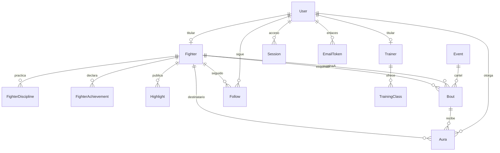

# Datos, estados y cambios de esquema

La fuente de verdad es [`schema.prisma`](../../prisma/schema.prisma) y sus [migraciones](../../prisma/migrations/). Este texto explica su significado; el [catálogo](CATALOGO.md) identifica cada migración y el [mapa](../MAPA-FUNCIONAL.md) quién escribe en las tablas.

## Relaciones principales

El diagrama representa relaciones centrales, no todas las columnas ni reglas de borrado. Para una cascada concreta leer `@relation(... onDelete: ...)`; varias bajas se implementan explícitamente en las acciones.

## Significado de las entidades

| Entidad o grupo | Responsabilidad y restricciones |
|---|---|
| `User`, `Session`, `EmailToken`, `RateHit` | Cuenta, acceso, enlaces y límites. Tokens en claro solo viajan al navegador/correo; la base guarda hash. Verificar consumo atómico. |
| `Fighter`, `FighterDiscipline` | Persona deportiva y carreras por disciplina. Una cuenta tiene como máximo una ficha propia; puede haber fichas provisionales sin cuenta. Récord previo y categoría actual no sustituyen la historia de cada combate. |
| `Event`, `Bout` | Velada y enfrentamiento con esquinas, resultado, método, categoría histórica, evidencia, estado y respaldo. Las restricciones de pareja/velada evitan duplicados; leer el schema para la clave exacta. |
| `Aura`, `Follow` | Reconocimiento y seguimiento. Unicidad de aura por usuario/combate/peleador y de seguimiento por usuario/peleador. |
| `FighterAchievement`, `SupportAccreditation` | Títulos declarados/revisados y permiso específico para respaldar hechos. No equivalen al rol de organizador ni a tener perfil de federación. |
| `ClaimRequest`, `OrganizerRequest`, `Report` | Solicitudes y revisión motivada. Quien solicita no obtiene automáticamente el permiso o la propiedad. |
| `Gym`, `Trainer`, `TrainingClass` | Directorio y ofertas de clases. En esta base las clases no son reservas. |
| `Profile`, `Highlight` | Identidad visual y contenido del deportista. `Profile.kind/entityId` resuelve distintas entidades desde código; no es una relación Prisma automática con todas ellas. |
| `AuditLog` | Historia de cambios relevantes; puede conservar datos en JSON y necesita limpieza de esas copias en bajas. |

## Estados que no deben confundirse

`Bout.verification`: `SELF_REPORTED` es declaración visible; `CONFIRMED` indica respuesta del rival; `VERIFIED` indica verificación; `DISPUTED` representa suspensión/en revisión y se excluye de cálculos. El desacuerdo del rival abre revisión y no aplica `DISPUTED` automáticamente. El estado del enum debe leerse junto al flujo de la acción que lo escribe.

`supportKind` y acreditación identifican respaldo adicional y su vigencia; no volver a sumar varios respaldos del mismo hecho. Modificar el hecho o su fuente limpia el respaldo previo. Los títulos retirados/rechazados no aportan aura; restaurarlos sigue una acción con comprobación de estado.

`Fighter.listed` y `hiddenAt` regulan publicación y privacidad. Una ficha provisional no aparece en listados/buscadores. `recordPublic` permite publicar el récord amateur; mantenerlo privado afecta presentación, no elimina los hechos de la base.

`Event.status` distingue velada programada/cancelada, y una cancelación excluye sus combates del récord/aura calculados. `TrainingClass.active` controla si se ofrece públicamente; no marca que una clase se haya celebrado.

## Datos calculados e historia

Récord y aura del ránking se derivan de hechos; no almacenar un total independiente sin decidir cómo invalidarlo y reconciliarlo. Las categorías y pesos de combates/títulos conservan el contexto histórico. Las divisiones deportivas tienen identificadores versionados: modificar el significado de uno existente cambia el pasado.

Las fechas de velada representan un día, guardado a las 12:00 UTC. Las comparaciones de «hoy» usan Madrid. No interpretar esa hora como hora de inicio anunciada. `dates.ts` valida días reales; no aceptar automáticamente una normalización de JavaScript como el 30 de febrero.

## Cambiar el schema con seguridad

1. Identificar lecturas, escrituras, exportación, eliminación, retención e índices afectados en el mapa y el catálogo.
2. Añadir cambio de schema y migración nueva; no reescribir una migración integrada.
3. Explicar valor por defecto, nulabilidad, unicidad, relación/borrado y qué ocurre con filas existentes.
4. Aplicar a una base local desechable vacía y comprobar paridad con `prisma migrate diff`, como hace el CI. Ver [Operación](OPERACION.md).
5. Probar compatibilidad de datos anteriores; que pase una base vacía no demuestra una migración de producción.
6. Para una operación real, preparar copia y comprobar restauración antes de ejecutarla, siguiendo la tarea/procedimiento aprobado. No ejecutar seed ni reinicios contra una base con datos reales.

Las herramientas de borrado requieren leer su alcance: el seed sustituye datos ficticios y tiene protección para bases con datos; anonimizar conserva hechos compartidos pero puede ser irreversible. No desactivar esas protecciones para hacer pasar una prueba.
