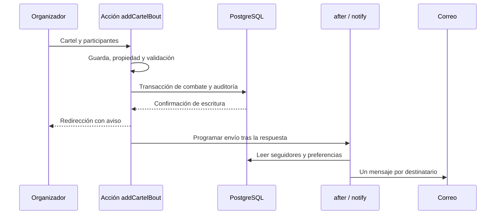

# Flujos completos y puntos de diagnóstico

Cada recorrido conecta pantalla, acción, regla, dato y respuesta. El [mapa funcional](../MAPA-FUNCIONAL.md) enumera todas las acciones; aquí se explica cómo leerlas sin depender de conversaciones. Los nombres de función son términos de búsqueda exactos.

## 1. Registro, correo y publicación

`/registro` y sus pasos → `accounts.register` → tipo/rol en `landing.ts`, validaciones y límite → transacción de `User` y, para entidad, `OrganizerRequest` → sesión y correo de verificación → `accounts.verifyEmail` → consumo de `EmailToken` y `User.emailVerifiedAt` → siguiente paso según cuenta.

Las elecciones de peleador o entrenador se guardan como intención validada en `User.onboarding` mientras no se pueden publicar. `fighters.createMyFighter` o `trainers.createMyTrainer` crean la entidad después de verificar; comprobar los nombres actuales en [CATALOGO.md](CATALOGO.md) y [MAPA-FUNCIONAL.md](../MAPA-FUNCIONAL.md). El entrenador puede crear su primera clase con el borrador.

Invariantes: no aceptar un rol privilegiado del formulario; una entidad necesita aprobación; tener borrador no equivale a tener ficha pública. La verificación y la recuperación se consumen con POST, no al abrir el enlace GET: los escáneres del correo pueden visitar enlaces automáticamente.

Si falla: revisar tipo de alta y rol guardado, `readOnboarding`, token/caducidad y transporte de correo. No imprimir el token ni el hash. Pruebas: `tests/e2e/cuenta.mjs`, `acceso.mjs` y `diseno.mjs`.

## 2. Un peleador declara un combate

`/mi-ficha` → `bouts.addBout` → cuenta verificada y ficha propia → lectura/validación de fecha, rival, disciplina, categoría y resultado → selección de candidato si hay homónimos → transacción de velada/combate y disciplinas → auditoría → `after(notifyRivalOfBout)` → `go` con aviso.

Un rival nuevo puede producir una ficha provisional; el nombre público y el slug evitan revelar el apellido completo hasta que procede publicarla. `pairKey` evita que invertir las esquinas cree otro enfrentamiento equivalente. `coherenceFlagsFor` señala proximidad sospechosa sin convertirla en rechazo automático.

La declaración cuenta identificada como tal. `respondBout` puede confirmar; el desacuerdo solicita revisión motivada. La suspensión del resultado corresponde a moderación, no al rival por sí solo. Las actualizaciones comparan los hechos leídos para evitar confirmar una versión que cambió mientras se respondía.

Si falla: seguir el código `problema` hasta `messages.ts`, comprobar selección de rival, fecha, clave de pareja, estado y condición de actualización. Pruebas: `rules.test.ts`, `coherence.test.ts`, `tests/e2e/flujo.mjs`, `integridad.mjs`, `pulido.mjs`.

## 3. Una promotora publica y avisa a seguidores

Solicitud → moderación aprueba → rol `ORGANIZER` → `/organizador` → `events.createEvent` → `Event` → `events.addCartelBout` → autorización sobre la velada y transacción de `Bout`/disciplinas/auditoría → `after(notifyFollowersOfBout)` → detalle público y correo.

`notifyFollowersOfBout` exige fecha futura y filtra correo confirmado/preferencias; agrupa por usuario si sigue a ambos participantes. Su invocación desde organización es la frontera de confianza; no usarla para que cualquier declaración envíe avisos a terceros.

`setBoutResult` anota resultados; `updateEvent` y `setEventStatus` modifican datos/estado y los cálculos excluyen cancelaciones. No asumir que esas acciones envían avisos de todos los cambios: verificar sus llamadas a `after` antes de prometerlo. La ficha incluye entradas externas si existe `ticketUrl`; la retransmisión no tiene campo dedicado en esta base.

Si falta un correo: comprobar origen de la llamada, fecha, seguimiento, `emailVerifiedAt`, `notifyEmails`, configuración y resultado del proveedor. Una escritura correcta no demuestra envío. Pruebas: `notify.test.ts`, `tests/e2e/paneles.mjs`, `calendario.mjs`.

## 4. Dar aura y consultar ránking

Ficha pública → `aura.giveAura` → cuenta verificada → `canGiveAura` → límite diario con bloqueo → `Aura` único usuario/combate/peleador → aviso → contador y comentarios. `removeAura` retira el voto del propio usuario.

Ránking → `auraRanking` → agrupación de votos + títulos válidos + combates respaldados → categoría histórica → `trajectoryByCategory`/`effectiveSupport` → tope del respaldo de combates → `rankByCategory` → posiciones con empates.

El récord deportivo se calcula por separado. El contador de comunidad no es el total de trayectoria y respaldo. Una acreditación revocada elimina el bonus efectivo; cambiar hechos o evidencia retira el respaldo anterior. El filtro de período del ránking limita comunidad, no títulos.

Si las cifras parecen distintas: comparar filtros, categoría histórica, estado de velada/combate, privacidad y componente mostrado antes de buscar una suma incorrecta. Pruebas: `aura.test.ts`, `trayectoria.test.ts`, `ranking-trayectoria.test.ts`, `tests/e2e/trayectoria.mjs`.

## 5. Perfil, imagen y caché

Editor `/perfiles/:kind/:id/editar` → `profiles.saveProfile` → correo confirmado + `profileAccess` + propiedad → normalización de archivos y posiciones → transacción de `Profile` y auditoría → cabecera/foto pública.

Petición de `/imagenes/:kind/:id/:slot` → validar tipo e identificador → comprobar entidad visible o permiso de edición → leer versión/indicadores → 204 si falta imagen, 304 si coincide ETag, 200 WebP si hay bytes. Validar visibilidad antes de responder 304 mantiene la protección al ocultar una ficha.

La versión revisada almacena bytes en PostgreSQL. No documentar S3 o una CDN como activos por existir un PR abierto. Pruebas: `profiles.test.ts`, `tests/e2e/perfiles.mjs`.

## 6. Publicar clases

Cuenta `TRAINER` → datos e intención → correo verificado → `trainers.createMyTrainer` → `Trainer` y primera `TrainingClass` opcional → `/mis-clases` → `createClass`/`toggleClass` → oferta activa en la ficha pública.

Validar con `parseClass`, resolver entrenador desde la sesión y comprobar propiedad de cada clase. La ficha muestra precio por persona/sesión. No hay transacción monetaria, reserva o asistencia guardada en esta versión.

Si una clase no aparece: revisar `active`, perfil vinculado y validación. Pruebas: `diseno-v3.test.ts`, `tests/e2e/diseno.mjs`.

## 7. Exportar o eliminar una cuenta

`/mi-cuenta/datos` → sesión → consultas de datos propios → JSON privado. Revisar las selecciones y la cabecera de caché al añadir cualquier dato personal.

`/mi-cuenta/eliminar` → `accounts.deleteAccount` → contraseña, protección del último moderador y transacción → eliminar o anonimizar ficha según combates → limpiar títulos, perfiles, highlights, clases, acreditación y copias en auditoría según código → borrar cuenta/sesiones → salida con mensaje.

La ficha con combates conserva su ID técnico y los hechos compartidos; no debe conservar nombre, imagen, slug identificable o copias del dato personal en auditoría. Añadir una tabla obliga a revisar este recorrido y la exportación. No extrapolar las cascadas: consultar [Datos](DATOS.md) y el schema.

Pruebas: `tests/e2e/cuenta.mjs`, `integridad.mjs`, `trayectoria.mjs`, `perfiles.mjs`, `diseno.mjs`.

## Revisar cualquier flujo nuevo

Escribir desencadenante y resultado visible; enlazar pantalla, acción, guarda, regla, tablas y pruebas; explicar transacción, concurrencia, fallo de servicios externos y privacidad. Comprobar un éxito y un rechazo real con el rol afectado. No declarar implementado un flujo que solo aparece en una maqueta o en el plan.
