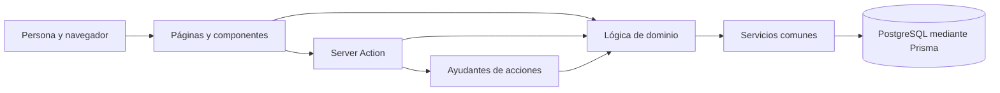

# Módulos y contratos

La organización actual es un monolito modular: una aplicación Next.js con responsabilidades separadas. [DESARROLLO.md](../DESARROLLO.md) contiene las recetas y [CATALOGO.md](CATALOGO.md) identifica cada archivo. Este documento explica los contratos que una modificación debe conservar.

## Capas

Las páginas también consultan Prisma directamente: el diagrama muestra responsabilidades, no una capa de servicios obligatoria. `src/lib` nunca importa interfaz; `common` no importa otros dominios. Cada dominio puede importar el suyo y `common`; `community` también puede importar `accounts`. `profiles` y `trainers` están incluidos en estas reglas. La autoridad ejecutable es [`arquitectura.test.ts`](../../tests/unit/arquitectura.test.ts).

## Entradas del servidor y respuesta

Los módulos de [`src/app/actions`](../../src/app/actions/) llevan `"use server"`: cada función exportada es invocable por una petición, incluso sin pasar por el botón previsto. Cada una debe verificar sesión, permiso sobre el objeto y datos recibidos. Mostrar u ocultar un botón no autoriza una escritura. [`autorizacion.test.ts`](../../tests/unit/autorizacion.test.ts) clasifica las acciones; es una comprobación estática, complementada con rechazos reales en navegador.

[`shared.ts`](../../src/app/actions/shared.ts) no lleva esa directiva. `str` normaliza textos; `checkLengths` limita tamaño; `go` termina con una redirección y un código de mensaje; `returnTo` conserva contexto sin permitir abandonar la ruta prevista. `go` conserva la sección mediante `seccion` porque una redirección de acción puede perder el fragmento. El componente `FlashNotice` ofrece el regreso a esa sección.

`guard` convierte `Rechazo`, Prisma `P2002` y `P2025` en mensajes conocidos; propaga errores imprevistos. No envolver `redirect` en una captura que lo transforme en un fallo normal: Next.js lo implementa con una excepción de control. `withLock` abre una transacción y obtiene un bloqueo consultivo de PostgreSQL por clave; dentro se usa el cliente `tx`, para que lectura y cambio compartan la protección. Su utilidad se explica en [Decisiones](DECISIONES.md).

## Cuentas (`accounts`)

[`auth.ts`](../../src/lib/accounts/auth.ts) convierte la cookie en una sesión consultando su hash. `getUser` devuelve la cuenta actual o `null`; no cachearlo con `cache()` de React, porque cerrar sesión y redirigir puede requerir una nueva lectura dentro de la misma petición. `requireUser` añade una redirección explicada; `requireVerifiedUser` exige control del correo. `permissions.ts` exige moderación u organización; `backing.ts` exige acreditación específica para respaldar hechos.

`password.ts` guarda parámetros de scrypt junto al hash y permite reforzarlos al entrar. `ratelimit.ts` usa `RateHit`, límites por clave y reserva atómica previa al cálculo de contraseña. `landing.ts` distingue tipo de alta, rol inicial y destino; una entidad comienza como `FAN` hasta que moderación aprueba su solicitud. El entrenador tiene rol `TRAINER`; no confundirlo con acreditación para respaldar.

`onboarding.ts` valida el JSON de intención guardado antes de confirmar el correo; no es una ficha ni una clase publicada. `retention.ts` limpia datos caducados; `maybePurge` limita la frecuencia por proceso y captura el error para no romper la petición. No es un servicio de tareas programadas ni garantiza una hora fija de limpieza.

Pruebas: [`password`](../../tests/unit/password.test.ts), [`ratelimit`](../../tests/unit/ratelimit.test.ts), [`recuperar`](../../tests/unit/recuperar.test.ts), [`landing`](../../tests/unit/landing.test.ts), y navegador [`acceso`](../../tests/e2e/acceso.mjs), [`cuenta`](../../tests/e2e/cuenta.mjs), [`diseno`](../../tests/e2e/diseno.mjs).

## Peleadores y récord (`fighters`)

`fighters.ts` busca candidatos por nombre normalizado; la persona elige un rival. Un nombre coincidente no demuestra identidad y no justifica fusionar fichas. `prior.ts` valida el récord de partida; un total sin detalle no inventa victorias ni derrotas. `record.ts` calcula por disciplina y nivel; descarta combates sin resultado, en revisión o de veladas canceladas. `combinedRecord` suma antecedentes solo cuando vienen detallados y mantiene el total no detallado separado.

`coherence.ts` produce señales para revisión, no prohibiciones automáticas; las disciplinas con torneos admiten varios combates cercanos. `privacy.ts` decide si ocultar el récord amateur: el titular puede verlo y el público solo si se ha hecho público. `graduation.ts` valida cinturón y grados, declarados por el deportista; no concede verificación. `highlights.ts` valida publicaciones, límites y orden: un vídeo es enlace externo; una foto se normaliza y almacena.

`anonymize.ts` elimina datos personales conservando la identidad técnica necesaria para los combates de los rivales; también limpia copias de datos en auditoría. No basta con cambiar el nombre visible. Leer [Datos](DATOS.md) antes de tocar borrados.

Pruebas: [`record`](../../tests/unit/record.test.ts), [`prior`](../../tests/unit/prior.test.ts), [`coherence`](../../tests/unit/coherence.test.ts), [`diseno-v3`](../../tests/unit/diseno-v3.test.ts), y navegador [`integridad`](../../tests/e2e/integridad.mjs), [`categorias`](../../tests/e2e/categorias.mjs), [`diseno`](../../tests/e2e/diseno.mjs).

## Combates (`bouts`)

`rules.ts` valida resultado y método según disciplina, define una clave de pareja independiente del orden de las esquinas y una versión de los hechos. Un resultado escrito desde la perspectiva A debe invertirse al mostrarlo desde B. `form.ts` transporta los campos admitidos al elegir un rival; la acción vuelve a validarlos.

`actions/bouts.ts` orquesta declaraciones, respuesta del rival, resultado propio, evidencia y retirada. `actions/events.ts` gestiona el cartel del organizador. `actions/moderation.ts` puede suspender o verificar. Las escrituras condicionadas al estado leído evitan que una respuesta antigua confirme hechos ya modificados. Confirmación del rival, decisión de moderación y respaldo acreditado son conceptos diferentes.

Pruebas: [`rules`](../../tests/unit/rules.test.ts), y navegador [`flujo`](../../tests/e2e/flujo.mjs), [`respaldo`](../../tests/e2e/respaldo.mjs), [`pulido`](../../tests/e2e/pulido.mjs).

## Aura (`aura`)

`rules.ts` decide elegibilidad en acción y pantalla: participación del destinatario, fecha, resultado, cancelación/revisión y voto propio. La acción añade correo verificado, límites diarios y escritura única. La clave de unicidad distingue usuario, combate y peleador: dar aura a ambas esquinas no es el mismo voto.

`trajectory.ts` centraliza la escala v1, categoría histórica y respaldo efectivo. Si una acreditación vinculada deja de estar activa o pierde su titular, el respaldo efectivo pasa a declarado. `achievementPoints` excluye títulos retirados/rechazados; `trajectoryByCategory` conserva el mayor aporte de un título por categoría. `WITHOUT_BOUT_BACKING` retira respaldo cuando cambia el hecho o su fuente.

`ranking.ts` combina trayectoria, respaldo opcional y comunidad por disciplina, nivel, división y peso históricos. El filtro temporal recorta comunidad, no borra títulos. El respaldo de combates tiene un tope por categoría. Los empates comparten posición. Algunas tarjetas de inicio y el contador de la ficha muestran solo aura del público: no confundir ese contador con el total del ránking.

Pruebas: [`aura`](../../tests/unit/aura.test.ts), [`trayectoria`](../../tests/unit/trayectoria.test.ts), [`ranking-trayectoria`](../../tests/unit/ranking-trayectoria.test.ts), y navegador [`trayectoria`](../../tests/e2e/trayectoria.mjs).

## Comunidad (`community`)

`reports.ts` define motivos por entidad y límite de avisos. `actions/community.ts` guarda solicitudes de revisión y seguimientos; un aviso no modifica por sí solo el resultado. `notify.ts` consulta seguidores con correo verificado y avisos activados, agrupa por usuario para no enviar dos mensajes a quien sigue ambas esquinas y permite que un destinatario falle sin impedir los demás.

La condición de «publicado por organizador» depende del punto de llamada en `addCartelBout`; `notifyFollowersOfBout` no verifica por sí misma el rol del llamante. No invocarla desde una declaración libre. Los avisos se lanzan con `after()` después de escribir. Los correos de decisión se envían aunque se hayan desactivado los avisos de nuevos combates, porque responden a una solicitud. `after()` no es una cola durable: ver [Operación](OPERACION.md).

Pruebas: [`notify`](../../tests/unit/notify.test.ts), [`enlaces-correo`](../../tests/unit/enlaces-correo.test.ts), y navegador [`paneles`](../../tests/e2e/paneles.mjs), [`flujo`](../../tests/e2e/flujo.mjs).

## Perfiles e imágenes (`profiles`)

`profiles.ts` admite tipos concretos, resuelve la entidad origen y combina titular natural, titular asignado y moderación. En peleadores y promotores no concede edición por un titular asignado al perfil si no corresponde al origen. Los metadatos públicos se seleccionan sin bytes de imagen; evitar traerlos en cada listado.

`images.ts` admite JPEG, PNG o WebP estático, limita bytes/píxeles, orienta, reduce sin ampliar y genera WebP. La ruta de imágenes comprueba visibilidad antes de usar ETag y leer bytes. En la base revisada los bytes viven en PostgreSQL y la respuesta es `private, no-cache`; el PR #23 propone otro almacenamiento/caché y exige actualizar este contrato al integrarse.

Pruebas: [`profiles`](../../tests/unit/profiles.test.ts), y navegador [`perfiles`](../../tests/e2e/perfiles.mjs), [`diseno`](../../tests/e2e/diseno.mjs).

## Entrenadores y clases (`trainers`)

`classes.ts` valida clase individual/colectiva, título, duración, precio, horario y plazas; el precio es por persona y sesión. `actions/trainers.ts` exige cuenta de entrenador verificada, resuelve su perfil y restringe cambios a sus clases. Crear perfil puede consumir la primera clase del borrador y limpiar `User.onboarding` en una transacción. La ficha pública solo muestra clases activas.

Estas clases son ofertas publicadas: no existen en esta base reservas, cobros ni confirmación de asistencia. No presentar una publicación como una venta realizada. Pruebas: [`diseno-v3`](../../tests/unit/diseno-v3.test.ts) y navegador [`diseno`](../../tests/e2e/diseno.mjs).

## Servicios y catálogos (`common`)

| Grupo | Contrato |
|---|---|
| `db`, `audit` | Cliente Prisma compartido; la auditoría es atómica con el cambio cuando se le pasa `tx`. |
| `dates`, `competition`, `disciplines` | Días de Madrid, divisiones versionadas y catálogos de pesos/métodos; las categorías de un hecho histórico no se recalculan desde la ficha actual. |
| `safe`, `paths`, `url`, `text` | Claves propias, parámetros únicos, rutas internas, enlaces HTTP(S) y límites; una URL HTTP(S) admitida no demuestra la fiabilidad de su contenido. |
| `names`, `labels`, `messages` | Nombres públicos según privacidad, etiquetas y mensajes centralizados; no exponer enums internos como texto de interfaz. |
| `search`, `pagination` | Búsqueda por palabras sin tildes, consultas parametrizadas y paginación acotada; requiere PostgreSQL. |
| `mail`, `env`, `demo` | Transporte de correo, configuración comprobada al arrancar y permisos excepcionales solo de demo ficticia. |
| `apariencia` | Colores por disciplina e iniciales derivados de datos; fuente de la decisión visual en `DISENO.md`. |

Cada archivo y las pruebas concretas aparecen en [CATALOGO.md](CATALOGO.md). No convertir `common` en un almacén de reglas que pertenecen a un dominio.

## Interfaz, scripts y pruebas

Las páginas del App Router renderizan en servidor salvo componentes con `"use client"`; los componentes de cliente gestionan interacción, no permisos. `_inicio` selecciona experiencias por papel y consultas compartidas. `layout.tsx` compone navegación y avisos; `globals.css` mantiene estilos antiguos y v3 mientras se migra el diseño. Una modificación compartida requiere revisar todos los papeles y móvil.

Las rutas `route.ts` sirven imágenes, exportación privada y salud. `middleware.ts` limpia parámetros; no sustituye las guardas de las acciones. `instrumentation.ts` valida entorno al arrancar. `src/pages/_error.tsx` cubre el error del Pages Router usado por Next.js, aunque las pantallas estén en App Router.

Scripts: arranque de demo, entorno aislado, mapas y examen de ingreso tienen objetivos distintos; leer [Operación](OPERACION.md) antes de ejecutarlos. Las unitarias comprueban reglas y restricciones estáticas; los recorridos de navegador comprueban permisos y respuesta visible; axe cubre parte de accesibilidad. Ninguno demuestra por sí solo comprensión por personas, funcionamiento en dispositivos reales o capacidad bajo carga.
